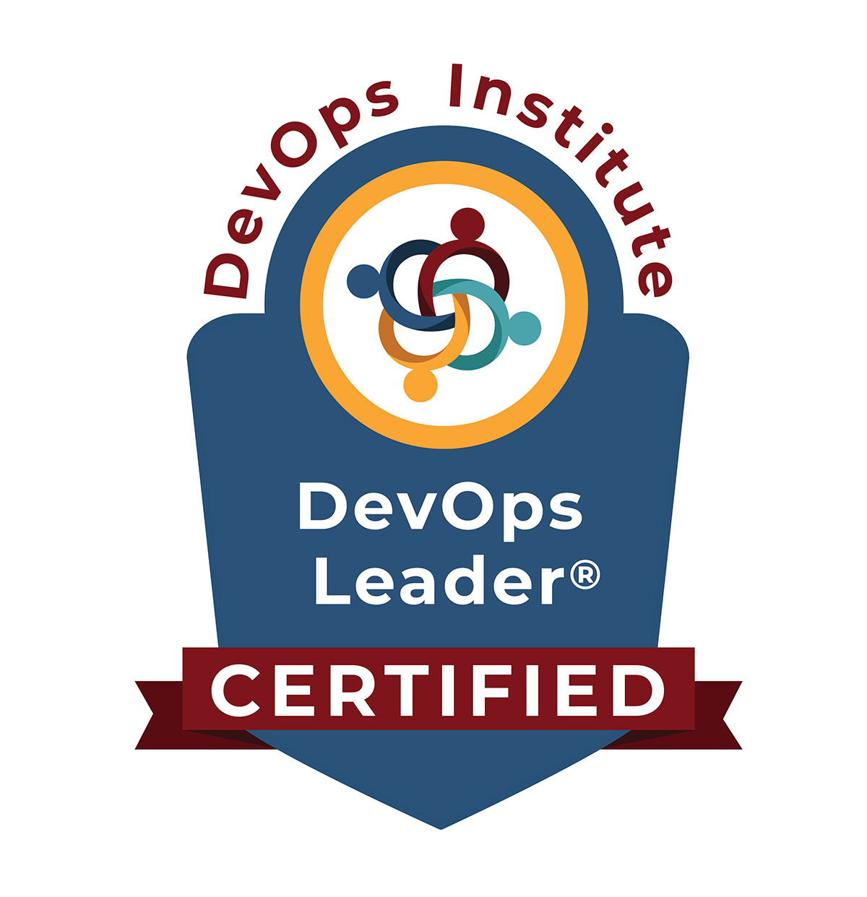

### Hi there 👋

I am an accomplished senior systems developer with over 20 years experience building well-architected IT solutions. With core values of compassion, curiosity, and transparency, and a contagious can-do attitude, always ready to solve tough problems, inspire teams, and lead by example.

Lately, I have been using AWS and Google Cloud Services to provide an awesome experience for our [Celtx](https://www.celtx.com) fans!

### News

I am now DevOps Leader (DOL)® certified!

See my full credential here: [DevOps Leader (DOL)®](DevOps_DOL_Certificate.pdf)

<!--
**rgpower/rgpower** is a ✨ _special_ ✨ repository because its `README.md` (this file) appears on your GitHub profile.

Here are some ideas to get you started:

- 🔭 I’m currently working on ...
- 🌱 I’m currently learning ...
- 👯 I’m looking to collaborate on ...
- 🤔 I’m looking for help with ...
- 💬 Ask me about ...
- 📫 How to reach me: ...
- 😄 Pronouns: ...
- ⚡ Fun fact: ...
-->
